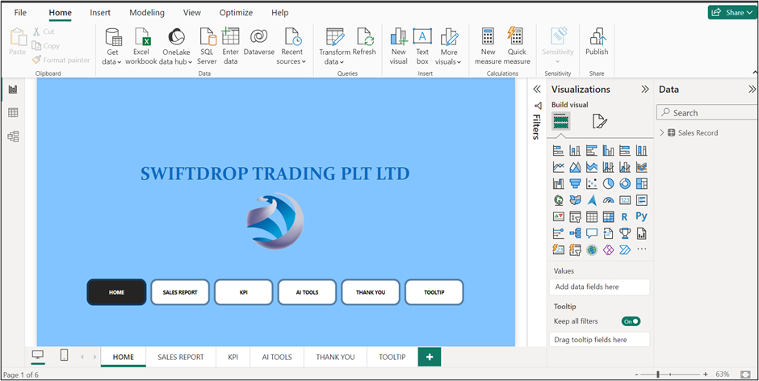
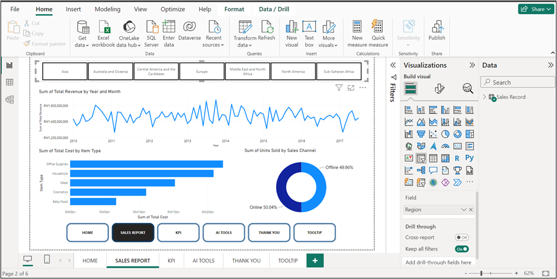
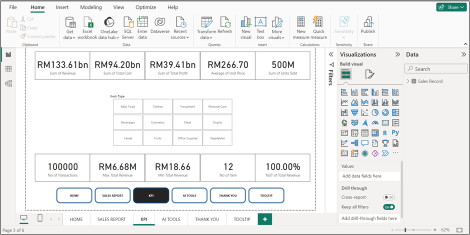
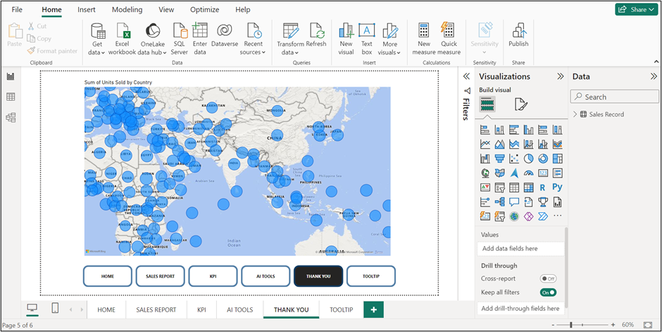
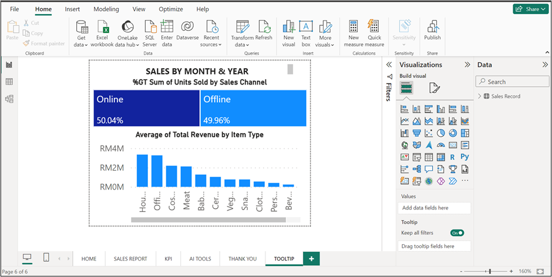

# Sales Performance Analysis Dashboard

## 🚀 Project Description
This project showcases a **comprehensive sales performance dashboard** built using **Power BI**, leveraging a dataset with multiple sales dimensions such as region, country, item type, sales channel, and more. The dashboard provides insights into sales performance, profitability, and operational efficiency across regions and countries.

## 🎯 Objective
The primary objective is to analyze the sales data, uncover patterns, and present key performance indicators (KPIs) that support strategic decision-making. The analysis aims to:
- 📍 Identify **top-performing regions and countries**.
- 🛒 Evaluate **sales channel performance** (online vs. offline).
- 📈 Track **sales and profit trends** over time.
- 💰 Determine the **most profitable item types** contributing to revenue.

## 📝 Key Features of the Dashboard
- **Sales Overview:**

   - A summary of total sales, total revenue, total cost, and total profit.
   - KPIs for overall performance with comparisons to previous periods.

- **Regional and Country Performance:**
   - Visualizations (such as line and bar charts) showing sales distribution and performance across different regions and countries.
   - Identification of regions with the highest and lowest sales volumes and profits.

- **Item Type Analysis:**
   - Detailed breakdown of sales and profit margins by item type.
   - Visualization of top-selling items and their profitability.

- **Sales Channel Performance:**
   - Analysis of sales performance across different channels (e.g., online vs. retail).
   - Comparison of revenue, profit, and units sold between channels.

- **Trend Analysis:**
   - Time series analysis to identify sales trends over various periods (monthly, yearly).
   - Visualization of peak sales periods and potential seasonal trends.

## 🔧 Tools and Technologies
   - Power BI: Used for data modeling, visualization, and dashboard creation.
   - DAX (Data Analysis Expressions): Used for creating calculated columns and measures to enhance analysis.
   - Power Query: Employed for data cleaning and transformation.

## 📊 Dashboard Visuals

| Home Page      | Sales Report     | KPI Dashboard    | Region Map     | Tooltips      |
|:--------------:|:----------------:|:----------------:|:--------------:|:-------------:|
|  |  |  |  |  |

## 🏁 Conclusion
The **Sales Performance Analysis Dashboard** delivers actionable insights through intuitive visualizations, enabling stakeholders to optimize sales strategies and improve profitability. With a clear understanding of sales performance metrics, decision-makers can align strategies with business objectives for greater operational success.

**Note: The project is based on the "100000 Sales Records.csv" file, cleaned and transformed into "Sales Records.csv".**

